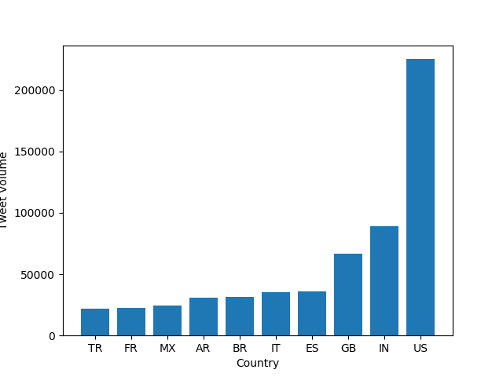

# Twitter Data Analysis on Coronavirus

This project involves using the MapReduce method in order to analyze tweets related to the coronavirus and similar topics in 2020.  The topics analyzed come from key hashtags.

We can break this procedure down into its  map and reduce portions.

**Map:**
The `map.py` file processes the zip file for an individual day.  It tracks the language used in the tweet and the country that it is tweeted from.  For example, the following command creates a folder `outputs` that contains a file `/geoTwitter20-02-16.zip.lang`.
This is a file that contains JSON formatted information summarizing the tweets from 16 February.

```
$ ./src/map.py --input_path=/data/Twitter\ dataset/geoTwitter20-02-16.zip
```

Since we want to track the tweets from the entire year (not just a specific day), we should use the following command.  It will run `maps.py` for every zip files for each day of 2020:
```
$ nohup sh run_maps.sh &
```

**Reduce:**
The next step is the reduce portion.  The `reduce.py` file merges the outputs generated by the `map.py` file so that the combined files can be visualized.
We can use the glob to merge output files as follows:
```
$ ./src/reduce.py --input_paths outputs/geoTwitter*.lang --output_path=reduced.lang
```
and

```
$ ./src/reduce.py --input_paths outputs/geoTwitter*.country --output_path=reduced.country
```
These commands generate the files `reduced.lang` and `reduced.country` respectively, with the data for all of 2020.


**Visualize:**
`visualize.py` takes `--input_path` and `key` as inputs and generates a bar graph of the top 10 languages or countries (depending on what the input is).

This command:
```
$ ./src/visualize.py --input_path=reduced.lang --key='#coronavirus'
```
Creates the following visualization:

## Tweets with #coronavirus by language (2020)


This command:
```
$ ./src/visualize.py --input_path=reduced.country --key='#coronavirus'
```
Creates the following visualization:

## Tweets with #coronavirus by country (2020)




This command:
```
$ ./src/visualize.py --input_path=reduced.lang --key='#코로나바이러스'
```
Creates the following visualization:

## Tweets with #코로나바이러 by language (2020)


This command:
```
$ ./src/visualize.py --input_path=reduced.country --key='#코로나바이러스'
```
Creates the following visualization:

## Tweets with #코로나바이러 by country (2020)


**Alternative Reduce:**

`alternative_reduce.py` takes as input a list of hashtags (multiple `--keys` rather than just one).  It outputs a line graph where each line is the amount of time each specified key is used throughout 2020.

This command:
```
$ ./src/alternative_reduce.py --keys '#coronavirus' '#flu' '#sick'
```
Creates the following visualization:

## Tweets with #coronavirus, #flu, and #sick throughout 2020


This command: 
```
$ ./src/alternative_reduce.py --keys '#flu' '#sick'
```
Creates the following visualization:

## Tweets with #flu and #sick throughout 2020


